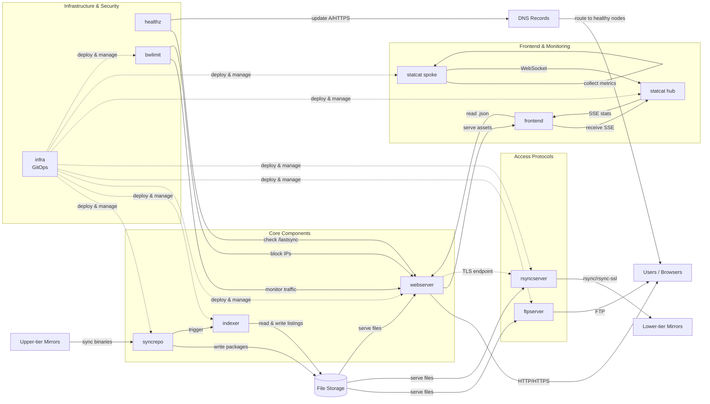

# [ftp.io.kr](https://ftp.io.kr)

> Fully featured Arch Linux package mirror operated by @pmh-only

## Architecture Design Scopes

1. **High Availability** and **Scalability**\
   ftp.io.kr focuses on enterprise-grade reliability and elasticity by implementing modern Kubernetes best practices, proper health checks, and load balancing.\
   Core components in all nodes work independently without inter-node communication.
2. **User Satisfaction**\
   ftp.io.kr provides pure HTML directory listings to ensure compatibility with environments that lack GUI browsers, such as fresh Arch Linux installations. Since listing pages are rendered early and served via HTTP streaming, users can view directory items immediately without waiting for HTML rendering or download completion.\
   For modern browsers, ftp.io.kr also offers a React-based frontend with virtualized tables, preventing browser crashes when loading large directory listings.
3. **Transparency** and **User Privacy**\
   ftp.io.kr's source code is publicly available without any hidden components. Its ArgoCD instance implements a single-source-of-truth approach, ensuring that all public configurations are applied exactly as displayed without any modifications.\
   Additionally, ftp.io.kr does not collect any tracking data or cookies, preserving complete user anonymity.
4. **Cost Optimization** and **Abuse Prevention**\
   ftp.io.kr's components are highly optimized for cloud infrastructure platforms to reduce operational costs while ensuring that less critical features do not impact the performance of core functionality.\
   ftp.io.kr also implements automated abuse prevention mechanisms using netflow/ipfix and iptables to block abusive users.

## Component details

- **[`webserver`](./webserver/) is the cattle component consisting of nginx instances that serve stored package binaries and pre-rendered directory listing files to user browsers.** It supports byte-range and ETag headers to ensure HTTP streaming and caching. It includes logic that reads the `Accept` header to decide whether to serve .html files (needed for terminal browsers) or .json files (needed for the React frontend). It also serves a public health check endpoint, frontend asset files, and a TLS-powered endpoint for `rsyncserver`. This component does not accept traffic until `syncrepo`'s `initsync` mode is completed.
- **[`syncrepo`](./syncrepo/) is the pet component consisting of shell scripts that periodically sync package binaries with upper-tier mirrors.** It also triggers `indexer` after each sync to pre-render directory listing files. It has two modes: `initsync` mode downloads all binaries from the upper-tier server to provision package storage initially, and `normal` mode checks for updates and applies changes incrementally.
- **[`indexer`](./indexer/) is the cattle component consisting of a series of Go processes. It is triggered by `syncrepo` or manually to traverse the entire directory structure of package storage and render directory listing files in .html and .json formats**. It also calculates the total size of directories and last modification dates recursively.
- **[`frontend`](./frontend/) is the React application that reads pre-rendered .json directory listing files and displays them in a virtualized table to prevent browser crashes when loading large lists.** It has the ability to handle incomplete .json data streams so users don't need to wait until .json data is fully loaded. It also renders `statcat`'s SSE events, which display bandwidth statistics. This component's assets are served by `webserver`.
- **[`statcat`](./statcat/) is the pet component, a Go application that collects network bandwidth metric data from multiple nodes and aggregates it to a single endpoint.** It has two modes: `hub` mode opens a Server-Sent Events (SSE) endpoint to send stats to the frontend and a WebSocket endpoint to receive metrics from each `spoke` node. `spoke` mode collects metrics from sysfs and sends them to the `hub` node.
- **[`healthz`](./healthz/) is the Cloudflare Worker application that checks the /lastsync file for all nodes and updates `A` and `HTTPS` DNS records to point to healthy nodes**, ensuring users can reach healthy nodes that have completed `initsync`.
- **[`bwlimit`](./bwlimit/) is the cattle component consisting of NetFlow/IPFIX, `pmacct`, and shell scripts that meter traffic from UDP, TCP, and other protocols. It aggregates traffic by destination IP and blocks abusive IP addresses**.
- **[`ftpserver`](./ftpserver/) is the pet component, a read-only vsftpd instance.** It supports `curl ftp.io.kr` commands since curl treats the domain as FTP protocol. It supports both active and passive modes. This component does not accept traffic until `syncrepo`'s `initsync` mode is completed.
- **[`rsyncserver`](./rsyncserver/) is the cattle component, a read-only rsyncd instance.** It supports syncing by lower-tier mirrors and provides an origin endpoint for nginx to support `rsync-ssl`. This component does not accept traffic until `syncrepo`'s `initsync` mode is completed.
- **[`infra`](./infra/) is the directory containing Kubernetes manifests and Helm charts to implement SSOT (Single Source of Truth) and GitOps.** It also implements automated updates for container images built by GitHub Actions.

## Component Relations

## Rights

&copy; 2025-2026. Minhyeok Park <pmh_only@pmh.codes>. \
See [LICENSE](./LICENSE) file for more information.
